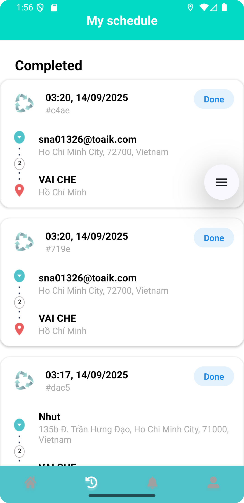

# VECHAI: Mobile Service Platform

## Overview

VECHAI is a comprehensive mobile service platform designed to connect users and drivers in a seamless, scalable, and secure environment. The project consists of a robust Python backend and two dedicated Android applications (Driver & User), enabling real-time service management, communication, and location tracking. Built with modern technologies and best practices, VECHAI is engineered for reliability, maintainability, and ease of deployment.

---

## Table of Contents

-   [Features](#features)
-   [Tech Stack](#tech-stack)
-   [Project Structure](#project-structure)
-   [Screenshots](#screenshots)
-   [Backend Setup](#backend-setup)
-   [Frontend Setup](#frontend-setup)
-   [License](#license)

---

## Features

-   🛠️ RESTful API
-   🔒 Auth & security
-   🔔 Real-time notifications
-   📦 Order & chat
-   📍 GPS tracking
-   ⭐ Ratings & reviews
-   🐳 Dockerized backend

---

## Tech Stack

**Backend:**

-   Python 3.12+
-   FastAPI, SQLAlchemy, Alembic
-   Docker & Docker Compose
-   Pytest

**Frontend:**

-   Android (Kotlin)
-   Gradle build system
-   Two separate apps: Driver & User

---

## Project Structure

```text
backend/                  # Backend API and services
frontend/
    VaiChe_Driver_App/      # Android app for drivers
    VaicheUserApp/          # Android app for users
```

---

## Screenshots

### Backend (Admin/API UI)

#### Interactive API Documentation


### Frontend (Mobile Apps)

**Driver App:**

<p align="center">
    
    
    
    
    
</p>

**User App:**

<p align="center">
    
</p>

---

## Backend Setup

1. **Clone the repository:**
    ```sh
    git clone <your-repo-url>
    cd backend
    ```
2. **Set up Python environment:**
    - Create virtual environment and install dependencies:
        ```sh
        uv sync
        ```
3. **Configure the database:**
    - Update `alembic.ini` and environment variables as needed.
    - Run migrations:
        ```sh
        alembic upgrade head
        ```
4. **Start the backend server:**
    - With Docker:
        ```sh
        docker-compose up --build
        ```
    - Or locally:
        ```sh
        uvicorn app.main:app --reload
        ```

---

## Frontend Setup

Each app (Driver and User) is an independent Android Studio project.

1. **Open the app folder in Android Studio:**

-   `frontend/VaiChe_Driver_App/` (Driver)
-   `frontend/VaicheUserApp/` (User)

2. **Configure local properties:**

-   Ensure `local.properties` points to your Android SDK.

3. **Build and run:**

-   Use Android Studio's build/run features or Gradle:
    ```sh
    ./gradlew assembleDebug
    ```

---

## Contact & Support

For questions, issues, or feature requests, please open an issue or contact the maintainer at [hoangphatnguyen1208@gmail.com].
